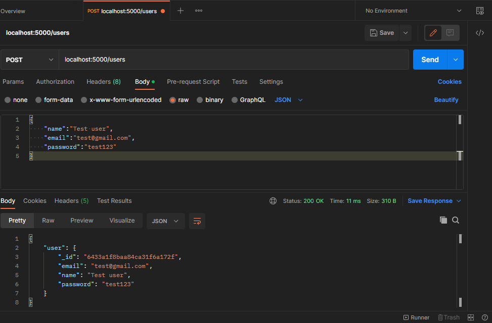
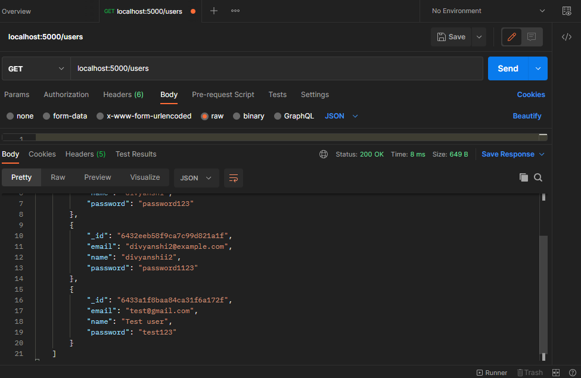
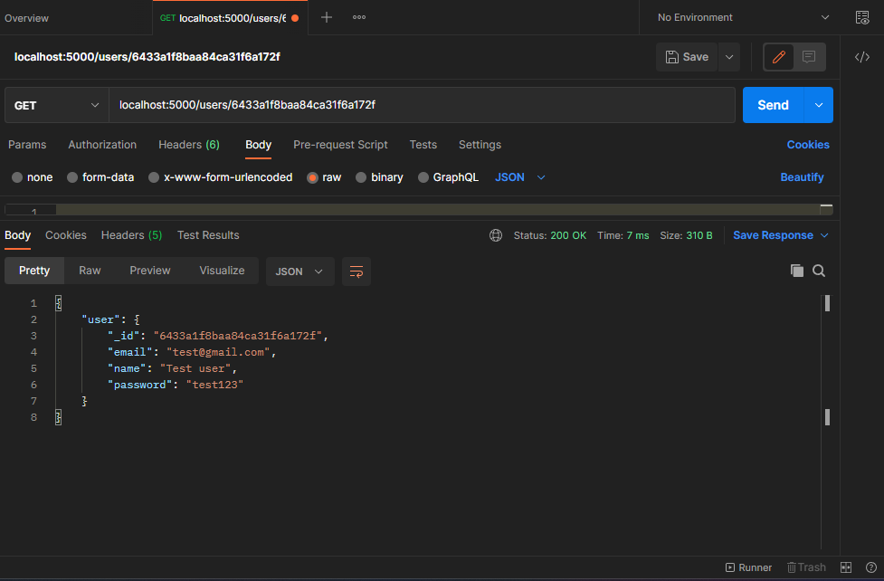
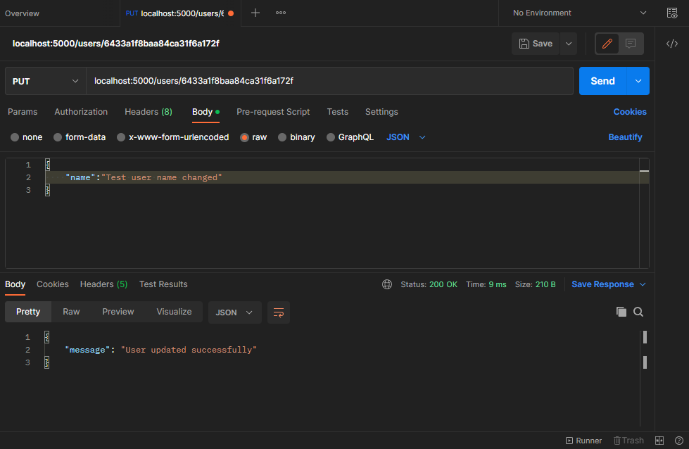
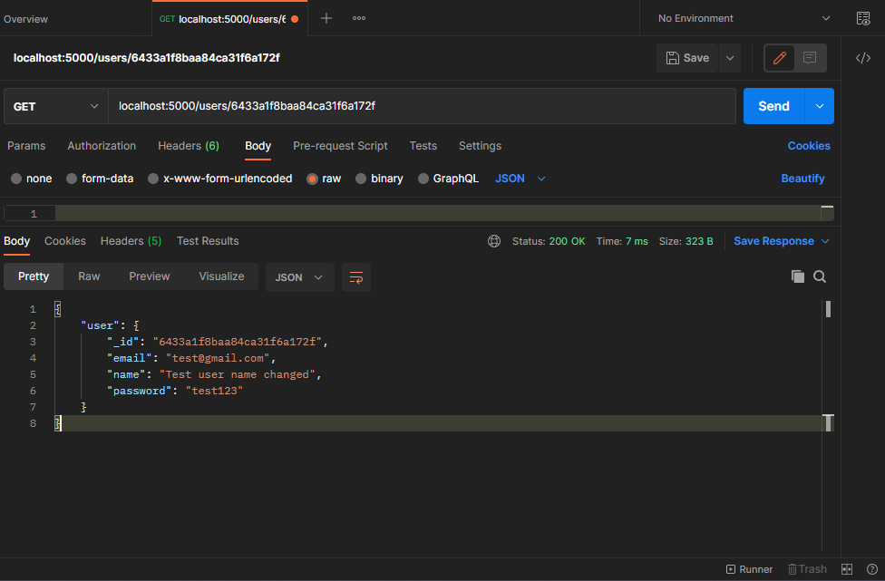
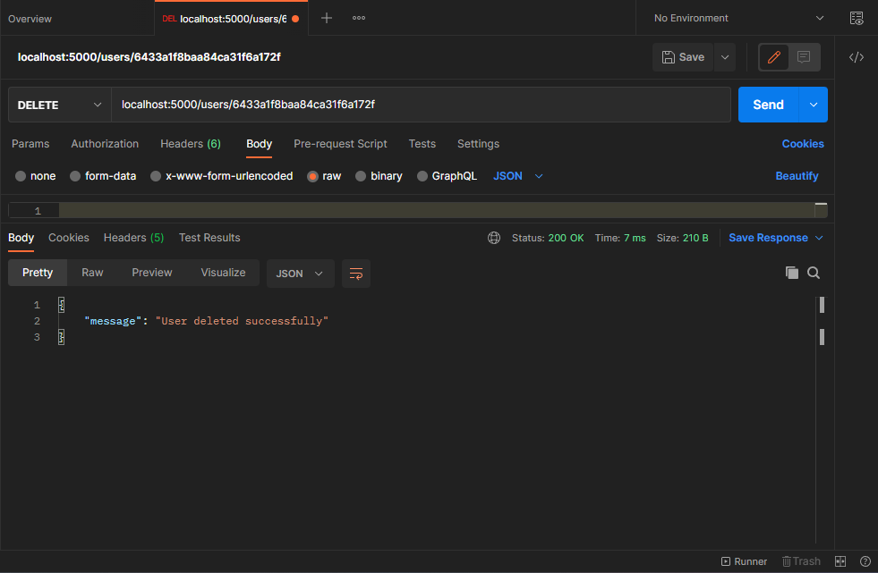

<h1 align=center> Corider Assignment </h1>
<h6 align=center> Flask application that performs CRUD (Create, Read, Update, Delete) operations on a MongoDB database for a User resource using a REST API.  </h6>

## Table of Content 🤖

- [Set Up](#set-up)
- [Features](#features--)
- [Run the Application](#run-the-application-)
- [Steps Performed](#steps-performed)
- [Working](#working)
- [Resources used](#resources-used)

## Set Up 

1. Create a new Python virtual environment and activate it.
2. Install Flask and PyMongo libraries using pip.
3. Install Postman for testing the REST API endpoints.
4. Create a new MongoDB database and collection for the application.
5. Download and install docker

## Features : 💯

The application should provide the following REST API endpoints:

-GET /users - Returns a list of all users.

-GET /users/id - Returns the user with the specified ID.

-POST /users - Creates a new user with the specified data.

-PUT /users/id - Updates the user with the specified ID with the new data.

-DELETE /users/id - Deletes the user with the specified ID.

## Run the Application 💫
1. python -m venv venv - make a virtual env
2. venv\Scripts\activate - Activate the virtual env
3. pip install -r requirements.txt
4. python app.py  
Note: to run app.py in venv change  'mongodb://mongo:27017/db' to 'mongodb://localhost:27017/db'  

To directly run docker use open terminal inside this repo and use -
- docker-compose up

## Steps Performed
1. MongoDB, postman installation
2. Read and understood documentation for pymongo
3. Implemented API's on app.py
4. Tested on Postman, also understood working of postman
5. Updated some features like - in POST action add user only when all data is provided, in PUT action/users/<id> we can update single data as well as all data 
6. Install docker and wsl 
7. Create dockerfile and docker-compose.yml file  

## Working
- POST /users - Creates a new user with the specified data

- GET /users - Returns a list of all users

- GET /users/id -Returns the user with the specified ID.

- PUT /users/id - Updates the user with the specified ID with the new data.

- DELETE /users/id - Deletes the user with the specified ID.

## Demonstration video 
- add video link <link>

# Resources used:
https://flask-restful.readthedocs.io/en/latest/ - for understanding flask-restful  
https://pymongo.readthedocs.io/en/stable/tutorial.html - for understanding pymongo  
https://www.digitalocean.com/community/tutorials/how-to-use-mongodb-in-a-flask-application - for understanding how to integrate flask and mongoDB  
https://medium.com/analytics-vidhya/creating-dockerized-flask-mongodb-application-20ccde391a - for docker implementation  

